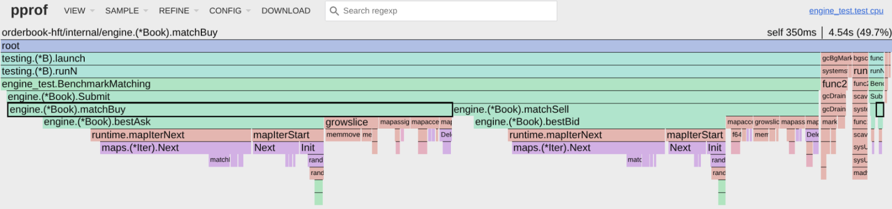

# Order Book HFT — Rapport d'audit de performance

| Élément | Détail |
|---|---|
| Auteur | Tanguy David |
| Cours | Optimisations & Performances Backend — Sup de Vinci, RNCP Bloc 4 |
| Projet | Order Book HFT (moteur d'appariement, Go) |
| Dépôt | `https://github.com/txngUI/orderbook-hft` — baseline figée au tag `baseline-naive` |

## 1. Problématique

Un **Order Book** maintient les ordres d'achat (`bids`) et de vente (`asks`) et produit des transactions selon une priorité **prix-temps**. Le matching est un **Hot Path** : exécuté pour chaque ordre, un coût CPU, mémoire ou GC répété des centaines de milliers de fois devient rapidement bloquant.

## 2. Environnement & baseline

| Élément | Valeur |
|---|---|
| CPU | AMD Ryzen 7 7735U — 8 cœurs / 16 threads |
| Cache | L1d/L1i 32 Ko par cœur · L2 512 Ko par cœur · L3 16 Mo partagé · ligne 64 o |
| RAM / OS | 16 Go LPDDR5 · Arch Linux |
| Runtime | Go 1.26.5 · linux/amd64 |
| Alimentation | Batterie · gouverneur `powersave` |
| Charge | 200 000 ordres, `seed=42`, prix bornés 99–101 € |
| Mesure | génération hors chrono ; 10 runs `go test -bench -count=10` |

**Baseline consolidée :** temps médian **77,75 ms** (moyenne 77,86 ± 0,96 ms, écart-type **1,2 %**), débit **2,57 M ordres/s**, **281 415 allocs/op**, **38,91 MiB/op**, 172 342 trades produits (invariant, seed fixe). La stabilité du banc (σ 1,2 %) permet d'attribuer les écarts aux optimisations plutôt qu'au bruit.

**Protocole :** charge déterministe ($N=200\,000$, `seed=42`), génération hors chrono, prix bornés (99–101 €) permettant l'indexation directe par tick. Deux niveaux de rigueur : *mesure simple* (1 run) et *baseline consolidée* (10 runs avec `b.ResetTimer()`, agrégés en médiane ± écart-type).

## 3. Diagnostic matériel & profiling

Le profil CPU (`pprof`) et le profil mémoire ont servi à identifier le véritable goulot avant d'optimiser.

| Poste observé | Mesure | Interprétation |
|---|---:|---|
| `matchBuy` | 50,5 % cum | Hot Path acheteur |
| `matchSell` | 41,8 % cum | Hot Path vendeur |
| `maps.(*Iter).Next` | **32,2 % flat / 44,7 % cum** | parcours de la map |
| `bestAsk` / `bestBid` | **~61 % CPU** | recherche du meilleur prix |
| `growslice` + `memmove` | ~15 % | réallocations des slices |
| `f64hash` + `aeshashbody` | ~9 % | coût du hashing `float64` |
| GC worker | ~3,5 % | pression mémoire |

```bash
# Capture (BenchmarkMatching, n = 200 000)
go test -bench=Matching -cpuprofile cpu.prof -benchtime=3s ./internal/engine_test
go tool pprof -top -cum cpu.prof
go test -bench=Matching -memprofile mem.prof ./internal/engine_test
go tool pprof -top -sample_index=alloc_objects mem.prof
```

**Conclusion :** goulot structurel — `map[float64][]Order` impose un parcours **O(n)** pour trouver le meilleur prix, tout en ajoutant du hashing flottant et des allocations. Le profiling justifie l'ordre des leviers suivants.



## 4. Journal d'optimisations

### Étape 1 — Localité de cache (`[]*Order` → `[]Order`)

**Objectif :** stocker les ordres d'un niveau dans un tableau contigu au lieu de pointeurs dispersés.
**Hypothèse :** les pointeurs dispersés provoquent des cache misses (~200 cycles) ; un tableau contigu exploite les lignes de cache de 64 o et le prefetcher.

Expérience isolée : contigu **422 502 ns/op** vs dispersé **11 185 513 ns/op** (**×26,5**).

| Métrique | Avant (naïf) | Après (contigu) | Gain |
|---|---|---|---|
| Temps | 77,8 ms ± 2 % | 72,8 ms ± 3 % | **−6,4 %** |
| Mémoire (`B/op`) | 38,9 MiB | 37,8 MiB | −3,0 % |
| Allocations | 281 416 | 81 421 | **−71,1 %** |

**Bilan.** Fort gain sur les allocations (−71 %) mais temps quasi inchangé (−6 %) : les allocations ne sont pas le goulot temporel. Le vrai goulot est le parcours $O(n)$ de `bestAsk`/`bestBid` (Loi d'Amdahl).

### Étape 2 — Prix en ticks (`float64` → `int64`)

**Objectif :** remplacer `float64` par un `int64` en ticks (100,05 € → 10005).
**Hypothèse :** ~9 % du CPU est consommé par le hachage `float64` (`f64hash` + `aeshashbody`). Une clé `int64` se hache plus vite. Prérequis de l'indexation par tableau.

| Métrique | Avant (`float64`) | Après (`int64`) | Gain |
|---|---|---|---|
| Temps | 72,8 ms | 68,6 ms | **−5,8 %** |
| Hachage (CPU) | ~9 % | `memhash64` ~2,5 % | **÷ ~4** |
| Allocations / Mémoire | inchangé | inchangé | — |

**Bilan.** Gain purement CPU. Le $O(n)$ de `bestAsk`/`bestBid` reste dominant.

### Étape 3 — `map` → tableau de ticks (best-price $O(1)$)

**Objectif :** remplacer `map[int64][]Order` par un tableau indexé par tick (`[][]Order`, $index = tick - minTick$) et deux curseurs `bestBidIdx`/`bestAskIdx`. Recherche du meilleur prix : $O(n) \to O(1)$.
**Hypothèse :** `bestAsk` + `bestBid` = **~61 % du CPU** ; un curseur supprime ce parcours.

| Métrique | Avant ($O(n)$) | Après ($O(1)$) | Gain | Significatif ? |
|---|---|---|---|---|
| Temps | 68,59 ms | **15,48 ms** | **−77,44 %** | ✅ $p=0,000$ |
| Allocations | 81,42 k | 78,09 k | −4,09 % | ✅ $p=0,000$ |
| Mémoire | 37,75 MiB | 37,62 MiB | −0,35 % | ✅ $p=0,000$ |
| `bestAsk`/`bestBid` (CPU) | ~61 % | ~0 % | goulot supprimé | profil |

**Bilan.** Levier le plus impactant (**−77 %**), ciblant directement le goulot algorithmique. *Compromis :* plage de prix bornée (`minTick..maxTick`) ; en production, la solution de référence est une **fenêtre glissante (re-centrage)** pour conserver le $O(1)$. *Re-profil :* les réallocations de slices (`growslice`/`memmove` ~30 %) deviennent le nouveau goulot.

### Étape 4 — Zéro-allocation (index de tête)

**Analyse préalable.** L'escape analysis (`go build -gcflags="-m"`) ne révèle aucun échappement accidentel. Le memprofile localise **97,8 %** des allocations dans `matchBuy`/`matchSell` sur les `append(b.bids/asks[prix], *o)`, avec `runtime.growslice` en tête : la slice de niveau étant stockée dans une structure sur le tas, ses réallocations pèsent lourd.

**Objectif :** supprimer les réallocations lors des dépilages.
**Hypothèse :** remplacer `level[1:]` (qui détruit la capacité) par un index de tête `head` par niveau. Reset (`level[:0]`, `head=0`) → tableau réutilisé au lieu d'être réalloué.

| Métrique | Avant ($O(1)$) | Après (index de tête) | Gain | Significatif ? |
|---|---|---|---|---|
| Temps | 15,48 ms | **10,70 ms** | **−30,89 %** | ✅ $p=0,000$ |
| Allocations | 78 088 | **457** | **−99,41 %** | ✅ $p=0,000$ |
| Mémoire | 37,62 MiB | 34,37 MiB | −8,65 % | ✅ $p=0,000$ |

**Bilan.** La suppression des allocations réduit **directement** le temps (**−31 %**) : `growslice`/`memmove` était devenu dominant après le passage au $O(1)$. Les 457 allocations restantes sont **structurelles** (croissance du slice `trades`, dimensionnement initial des niveaux).

### Étape 5 — Parallélisation (worker pool multi-symboles)

**Objectif :** exploiter les cœurs en traitant plusieurs carnets (symboles) en parallèle via un worker pool borné à `runtime.GOMAXPROCS(0)`.
**Hypothèse :** le matching d'un carnet est intrinsèquement séquentiel (priorité prix-temps). En distribuant $N$ carnets **indépendants** sur un pool de goroutines, le débit croît quasi-linéairement, **sans verrou**.

Charge : 64 carnets × 200 000 ordres, seed `42+symbole`.

| Cœurs (`GOMAXPROCS`) | Temps | Speedup | Efficacité | RAM de pointe (`Sys`) |
|---|---|---|---|---|
| 1 | 1 613 ms | ×1,00 | 100 % | ~50 MiB |
| 2 | 488 ms | ×3,31 | 166 % | ~86 MiB |
| 4 | 326 ms | ×4,94 | 124 % | ~179 MiB |
| **8** | **254 ms** | **×6,35** | **79 %** | **~340 MiB** |
| 16 | 262 ms | ×6,14 | 38 % | ~658 MiB |

**Bilan.**
- **Point optimal : 8 workers** (débit ×6,35, un worker par cœur physique).
- **Plateau à 16 threads.** Le SMT partage les ressources d'un cœur physique → léger reflux (USL).
- **Trade-off CPU ↔ RAM.** Le débit se paie en mémoire de pointe (chaque worker garde un carnet vivant).
- **Dimensionnement.** Charge CPU-bound → `workers ≈ cœurs` ; charge I/O-bound → `cœurs × 2–10`. Ici CPU pur, `GOMAXPROCS` est le bon réglage.
- **Caveat DVFS.** Le ×3,31 à 2 cœurs est un artefact `powersave`+batterie (baseline 1 cœur bridée). La forme de la courbe reste valide.

### Étape 6 — Recyclage des carnets (`sync.Pool`)

**Objectif :** recycler les `Book` entre symboles via un `sync.Pool` + méthode `Reset()`, hors Hot Path.
**Hypothèse :** supprimer l'allocation répétée d'un `NewBook` par symbole → moins de pression GC.

`GOMAXPROCS=8`, 64 symboles :

| Métrique | Sans pool | Avec pool | Effet |
|---|---|---|---|
| Temps | 222 ms | **163 ms** | **−27 %** |
| Alloc cumulé | 2 590 MiB | 1 664 MiB | **−36 %** |
| Passages GC | 35 | 19 | **−46 %** |
| RAM de pointe (`Sys`) | 249 MiB | 281 MiB | **+13 %** |

**Bilan.** Le pool gagne où on l'attend : moins d'allocations (−36 %) → moins de GC (−46 %) → moins de temps (−27 %). Mais **pas** un gain sur la RAM de pointe (+13 %) : le pool échange un pic mémoire plus haut contre moins de churn. Bon usage : quand la **pression GC** est le problème, pas quand la RAM de pointe est la contrainte.

### Étape 7 — Compacité du prix (`int64` → `int32`)

**Objectif :** réduire `sizeof(Order)` en stockant le prix sur `int32` au lieu d'`int64`.
**Hypothèse :** un tick tient dans un `int32` (±2,1 Md) ; la bande n'en fait que ~200. `Order` passe de **32 à 24 o** (−25 %). Une ligne de cache 64 o loge **2,67 ordres au lieu de 2** → meilleure densité en cache sur les files FIFO au repos.

**Structure mémoire de `Order` (`unsafe.Sizeof`) :**
- `int64` : ID (8o) + Side (1o) + Type (1o) + *pad* (6o) + Price (8o) + Qty (8o) = **32 o**
- `int32` : ID (8o) + Side (1o) + Type (1o) + *pad* (2o) + Price (4o) + Qty (8o) = **24 o** (−25 %)

| Métrique | `opt-zero-alloc` (`int64`) | `opt-int32` | Gain | Significatif ? |
|---|---|---|---|---|
| Temps | 10,70 ms | **9,67 ms** | **−9,63 %** | ✅ $p=0,000$ |
| Mémoire (`B/op`) | 34,37 MiB | 33,80 MiB | −1,65 % | ✅ $p=0,000$ |
| Allocations | 457 | 455 | −0,44 % | ✅ $p=0,000$ |

**Bilan.** Le gain est sur le **temps** (−9,63 %), pas sur les octets — le `B/op` est dominé par le slice de trades (172 342 trades) et `Trade` reste à 32 o. `int16` aurait été inefficace : les `uint64` (ID, Quantity) imposent un alignement 8 → même taille finale (24 o), plus un risque d'overflow (±32 767 ticks).

## 5. Confrontation critique — essais qui ont échoué

Les échecs font partie de la démarche : ils montrent qu'une intuition n'est pas une preuve.

### 5.1 Pré-allocation avide des niveaux

**Hypothèse :** réserver de grandes capacités (1024) supprimerait les dernières réallocations.

| Métrique | Zéro-alloc | Pré-alloc 1024 | Effet |
|---|---:|---:|---:|
| Temps | 10,70 ms | 11,36 ms | **+6,16 %** |
| Mémoire | 34,37 MiB | 45,33 MiB | **+31,89 %** |
| Allocations | 457 | 463 | +1,31 % |

**Pourquoi ?** L'index de tête recyclait déjà les tableaux : plus rien à supprimer. Réserver ~13 Mo par carnet ajoutait du `memclr` et gardait de la mémoire inutilisée. **Retour arrière.** Le bon objectif est « aucune allocation injustifiée », pas « zéro allocation à tout prix ».

### 5.2 Paralléliser un même carnet

**Hypothèse :** plusieurs goroutines sur un carnet protégé par un `Mutex` augmenteraient le débit.

| Version | Temps | vs séquentiel | Correction |
|---|---:|---:|---|
| Séquentiel | 11,5 ms | ×1,00 | ✅ 172 342 trades |
| Mutex, 1 goroutine | 13,5 ms | ×1,17 | ✅ |
| Mutex, 2 | 17,5 ms | ×1,51 | ⚠️ 172 326 |
| Mutex, 4 | 19,6 ms | ×1,70 | ⚠️ 172 345 |
| Mutex, 8 | 22,9 ms | **×1,98** | ⚠️ 172 310 |
| Mutex, 16 | 18,0 ms | ×1,56 | ⚠️ 172 195 |

Profil de contention : **99,35 %** du temps bloqué dans `sync.(*Mutex).Unlock` (1,65 s cumulé). Deux échecs simultanés : le verrou **sérialise** le travail (écroulement USL) et l'entrelacement détruit la priorité prix-temps → **trades non déterministes**. La parallélisation d'un carnet est abandonnée au profit du parallélisme **entre carnets indépendants**.

## 6. Synthèse des performances

Comparaison `benchstat` (10 runs, $N = 200\,000$, seed 42) et mesures d'I/O réseau.

| Version | Tag Git | Périmètre | Temps / Latence | Allocations | Mémoire | Impact & rôle |
|---|---|---|---:|---:|---:|---|
| **V0** | `baseline-naive` | Moteur mono-carnet | 77,8 ms | 281,4 k | 38,9 MiB | Référence |
| **V1** | `opt-cache-locality` | Structs contiguës | 72,8 ms | 81,4 k | 37,8 MiB | −6,4 % temps, −71 % allocs |
| **V2** | `opt-int64-ticks` | Prix en ticks | 68,6 ms | 81,4 k | 37,8 MiB | −12 % temps (hash `float64` éliminé) |
| **V3** | `opt-ticks-array` | Tableau de ticks | 15,48 ms | 78,1 k | 37,6 MiB | **−77 %** ($\div 4,4$) — suppression du $O(n)$ |
| **V4** | `opt-zero-alloc` | Index de tête | 10,70 ms | 457 | 34,4 MiB | **−86 %** ($\div 7,3$) — −99,4 % allocs |
| **V5** | `opt-int32` | Densité de cache | **9,67 ms** | **455** | **33,8 MiB** | **−87,6 %** ($\div 8,0$) |
| **V6** | *(échec)* | Contention carnet | 13,5 ms | 455 | 33,8 MiB | Abandonné (§ 5.2) |
| **V7** | `opt-scalability` | Parallélisme CPU | **×6,35 débit** | 3 640 | 270,4 MiB | Worker pool 8 cœurs |
| **V8** | `opt-reseau` | Protocole réseau | **P99 : 520 µs** | — | — | −30 % P99 gRPC vs REST à 500 req/s |
| **Finale** | *(état actuel)* | Moteur complet | **9,67 ms** | **455** | **33,8 MiB** | **$\div 8,0$ temps, $\div 618$ allocations** |

**Dynamique d'optimisation (Loi d'Amdahl).** Les premiers leviers (cache, `int64`) ont réduit les allocations sans gain temps majeur, le Hot Path étant masqué par le $O(n)$ (~61 % CPU). Le passage au **tableau $O(1)$** a débloqué le goulot principal (15,48 ms). La suppression des réallocations a ensuite révélé un second gain (10,70 ms). L'`int32` a fini par −9,6 % via densité cache.

**Cumul des axes.** Moteur mono-carnet : **$\div 8,0$** temps, **$\div 618$** allocations. Scalabilité multi-carnets : **×6,35** débit total sur 8 cœurs, au prix d'une empreinte proportionnelle aux carnets actifs.

**Validation processus (`hyperfine`, 50 runs) :**

| Binaire | Total | Matching | Coût fixe | Min / Max |
|---|---:|---:|---:|---:|
| Baseline (`ob`) | 83,1 ± 7,8 ms | 77,8 ms | **5,3 ms** | 72,5 / 117,8 ms |
| Finale (`ob_opti`) | **17,0 ± 1,0 ms** | 10,7 ms | **6,3 ms** | 15,0 / 19,1 ms |
| **Rapport** | **$\div 4,9$** | **$\div 7,3$** | — | — |

Le coût fixe (~5,5 ms de démarrage runtime + génération) pèse désormais **37 %** du binaire optimisé (vs 6 % baseline). Cet incompressible explique l'écart entre gain processus ($\div 4,9$) et gain algorithmique ($\div 7,3$).

## 7. Optimisation réseau — REST/JSON vs gRPC/Protobuf

Moteur identique, seul le protocole change. REST tiré à **Vegeta**, gRPC à **ghz**, sur le même Ryzen 7 7735U pendant 30 s.

**Hypothèses.**
- *REST/JSON :* parsing/sérialisation texte, noms de champs verbeux, allocations temporaires → queue de latence plus large, visible au **P99**.
- *gRPC/Protobuf :* format binaire compact (Varint, tags numériques), HTTP/2 multiplexé → réduction taille réseau et queue plus courte via moins de churn GC.

| Charge / protocole | Succès | Moyenne | P50 | P95 | **P99** | Max |
|---|---:|---:|---:|---:|---:|---:|
| REST · 500 req/s | 100 % | 356 µs | 351 µs | 491 µs | **745 µs** | 3,73 ms |
| gRPC · 500 req/s | 100 % | 360 µs | 350 µs | 460 µs | **520 µs** | **1,74 ms** |
| REST · 2 000 req/s | 100 % | 240 µs | 227 µs | 366 µs | **453 µs** | 3,31 ms |
| gRPC · 2 000 req/s | 99,998 % | 277 µs | 266 µs | 396 µs | **499 µs** | 3,75 ms |

**À 500 req/s :** moyennes identiques (356 vs 360 µs), mais gRPC réduit le **P99 de 30 %** (745 → 520 µs) et le max de **53 %** (3,73 → 1,74 ms). L'effet attendu se voit dans la queue.

**À 2 000 req/s :** la tendance s'inverse. gRPC est plus lent sur la moyenne (+15 %), le P99 (+10 %) et le max (+13 %), avec 1 `Unavailable`. Trois hypothèses à instrumenter : overhead HTTP/2 et connexion TCP unique côté `ghz`, contention du `Mutex` du handler, et avantage limité de Protobuf sur payload minuscule.

**Payload :** requête JSON ~63 o vs Protobuf ~8–12 o (~5–8× moins). Le streaming bidirectionnel `StreamOrders` est défini côté gRPC mais **non benchmarké** dans cette étude.

**Conclusion.** Sur ce micro-benchmark local, le protocole n'est pas le goulot unique. L'effet dépend de la **charge**, du **payload** et de la **topologie**. Aucune règle absolue « REST » ou « gRPC » n'en découle : gRPC gagne clairement sur la queue à faible charge et sur le payload réseau ; REST reste imbattable en simplicité opérationnelle et rivalise sur un banc local à charge élevée.

## 8. Guide d'exécution et outillage

Le `Makefile` automatise tests, benchmarks, profils, charges réseau et comparaisons. Les sorties sont archivées et associées aux tags Git.

| Commande | Usage |
|---|---|
| `make help` | Affiche toutes les cibles disponibles |
| `make test` | Tests de correction du moteur |
| `make bench` | Benchmarks de performance du moteur |
| `make save NAME=<tag>` | Archive un résultat pour comparaison |
| `make compare A=<tag> B=<tag>` | Compare deux séries avec `benchstat` |
| `make align` | Vérifie l'alignement mémoire des structures |
| `make profile` | Génère un profil CPU pour `pprof` |
| `make snapshot` | Génère la vue HTML statique du carnet |
| `make server-rest` · `make server-grpc` | Lance les deux serveurs d'exposition |
| `make proto` | Régénère les sources Protobuf et gRPC |

*Cibles secondaires accessibles via `make help`.*

`constitution.md` sert de garde-fou : **mesurer avant d'optimiser**, associer chaque levier à une hypothèse et une preuve, éviter allocations/goroutines injustifiées, conserver des mesures rejouables.